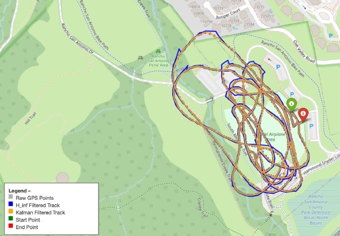
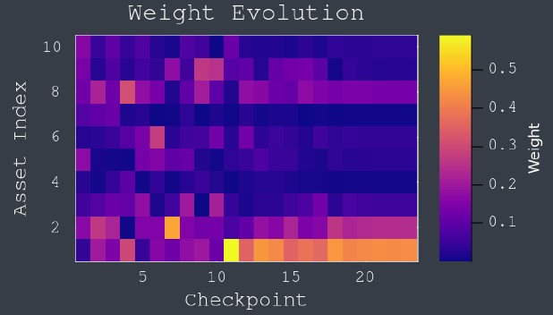
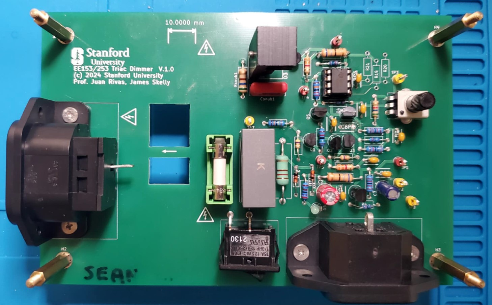

# Overview

*Note as of August 2026: I am currently in the process of a content migration from what was my previous site. Please excuse missing content, I am either in the process of documenting it or transferring it.  Thanks!*

Hi!  Welcome to my engineering portfolio!  

My name is Sean Lin.  I am an astronautical engineer (specializing in spacecraft GNC) and I have been making for forever.  Here you can find all the things I have built. 

I also have included my academic coursework with their associated cheatsheets, projects, or an earnest course review. 

I enjoy both hardware and software in the name of learning, utility, or art.  Peruse everything I've done as an engineer, from my earliest high school tinkerings to my latest weekend timekillers. 

### Other Links: 

  <a href="./assets/pdfs/Sean_Lin_CV_8_26.pdf" style="background-color: #0969da; color: white; padding: 8px 16px; border-radius: 6px; text-decoration: none; font-weight: bold; margin: 0 4px; display: inline-block;">Resume / CV</a>
  <a href="https://slin1923.github.io/" style="background-color: #2da44e; color: white; padding: 8px 16px; border-radius: 6px; text-decoration: none; font-weight: bold; margin: 0 4px; display: inline-block;">Les guides pour les nuls</a>
  <a href="https://seanlin.dev" style="background-color: #8250df; color: white; padding: 8px 16px; border-radius: 6px; text-decoration: none; font-weight: bold; margin: 0 4px; display: inline-block;">Personal Blog</a>

# Projects

## 2026

  
  

    <h3 style="margin:0 0 8px 0;"><a href="https://yoursite.com/project-1" style="text-decoration:none; color:#1a1a1a;">Cubli (WIP)</a></h3>
    
Inspired by the project of the same name from ETH Zurich, I decided to build my own little controls sandbox. The goal is to get the cube to balance on a corner or an edge.

    

      #controls#dynamics#PID#SS#LQR#systemID
    

  

## 2025

  
  

    <h3 style="margin:0 0 8px 0;"><a href="https://yoursite.com/project-1" style="text-decoration:none; color:#1a1a1a;">Beyond EKF</a></h3>
    
An exploratory navigation project that employs filtering algorithms not classically taught in school but widely used in the world.

    

      #GPS#navigation#EKF#UKF#particle-filter#H-infinity
    

  

  
  

    <h3 style="margin:0 0 8px 0;"><a href="https://yoursite.com/project-1" style="text-decoration:none; color:#1a1a1a;">A Perceptive Markowitz Model</a></h3>
    
An exercise in optimization techniques: a simple portfolio composition optimizer.

    

      #finance#genetic-algorithms#markowitz-model
    

  

  
  

    <h3 style="margin:0 0 8px 0;"><a href="https://yoursite.com/project-1" style="text-decoration:none; color:#1a1a1a;">Triac Light Dimmer</a></h3>
    
A showcasing of power electronic principles, all to dim a light.

    

      #power-electronics#rectifiers#converters#FETs
    

  

## 2024

  
  

    <h3 style="margin:0 0 8px 0;"><a href="https://yoursite.com/project-1" style="text-decoration:none; color:#1a1a1a;">Wendy II</a></h3>
    
Completely unrelated to Wendy I, this is a propulsion system test-bench that I designed for electric propellers.

    

      #dynamics#propulsion#instrumentation#embedded-systems#RPi5
    

  

  
  

    <h3 style="margin:0 0 8px 0;"><a href="https://yoursite.com/project-1" style="text-decoration:none; color:#1a1a1a;">Airship Aerodynamics</a></h3>
    
My first CFD project was to characterize the aerodynamic coefficients of an airship's envelope across varying attitudes.

    

      #CFD#simulation#aerodynamics
    

  

  
  

    <h3 style="margin:0 0 8px 0;"><a href="../projects/wendy1.html" style="text-decoration:none; color:#1a1a1a;">Wendy I</a></h3>
    
An NDA-friendly account of my internship work with MIT-spinout De-Ice.

    

      #inverters#thermal-management#instrumentation#heat-transfer#IR imaging
    

  

## 2023

  
  

    <h3 style="margin:0 0 8px 0;"><a href="https://yoursite.com/project-1" style="text-decoration:none; color:#1a1a1a;">Parametric Design Learning (PaDeSa)</a></h3>
    
A collaborative project riding the then-nascent AI train. If AI can generate images and videos, why can't it generate... 3D objects?

    

      #engineering-design#regression#GAN#classification#RL
    

  

  
  

    <h3 style="margin:0 0 8px 0;"><a href="https://yoursite.com/project-1" style="text-decoration:none; color:#1a1a1a;">Eggspresso</a></h3>
    
My mechanical engineering capstone project. An ambitious endeavor to have breakfast eggs be as easy as your Keurig coffee.

    

      #mechatronics#manufacturing#design#prototyping#power
    

  

  
  

    <h3 style="margin:0 0 8px 0;"><a href="https://yoursite.com/project-1" style="text-decoration:none; color:#1a1a1a;">Magnetic Levitation and Balanced Inverted Pendulum</a></h3>
    
We have graduated from Simulink models to real-world systems.

    

      #PID#SS-control#dynamics#modeling#robustness
    

  

## 2022

  
  

    <h3 style="margin:0 0 8px 0;"><a href="../projects/qubesat.html" style="text-decoration:none; color:#1a1a1a;">Qubesat</a></h3>
    
The single project I dedicated the most of my time to at Berkeley. We tried to launch this shoe-sized satellite containing an experimental quantum gyroscope.

    

      #satellite#bus#structures#avionics#thermal#NASA#Astra
    

  

## 2021

  
  

    <h3 style="margin:0 0 8px 0;"><a href="../projects/sixt33n.html" style="text-decoration:none; color:#1a1a1a;">Voice Controlled Car</a></h3>
    
We used the most rudimentary of ML methods to teach a car to recognize 4 voice commands.

    

      #circuits#voice_signals#PCA#SVD#controls
    

  

  
  

    <h3 style="margin:0 0 8px 0;"><a href="../projects/me100.html" style="text-decoration:none; color:#1a1a1a;">Bike Thief Violator</a></h3>
    
My first original mechatronics project which gives the conniving bike thief an unscheduled prostate exam. 

    

      #mechatronics#ESP32#IMU#H-bridge
    

  

  
  

    <h3 style="margin:0 0 8px 0;"><a href="../projects/watch_escapement.html" style="text-decoration:none; color:#1a1a1a;">Mechanical Watch Escapement</a></h3>
    
A study on the internal dynamics of a mechanical watch as well as my first time LaTeX typesetting.

    

      #dynamics#pendulum#tensors#LaTeX
    

  

## < 2020

  
  

    <h3 style="margin:0 0 8px 0;"><a href="https://github.com/slin1923/BYOW" style="text-decoration:none; color:#1a1a1a;">Build Your Own World</a></h3>
    
A simple PvP game that served as an exercise in the usage of data structures.

    

      #game-design#data-structures#graph-theory#java
    

  

  
  

    <h3 style="margin:0 0 8px 0;"><a href="../projects/scioly.html" style="text-decoration:none; color:#1a1a1a;">Science Olympiad Builds</a></h3>
    
I was an engineering specialist for my years as a competitor. Here is my high school highlight reel.

    

      #tower#boomilever#helicopter#mousetrap-vehicle#optics#wind-power#scioly
    

  

# Courses
## Stanford

### Summer 2026
- **EE364A**: Convex Optimization (S. Boyd)
- **16.S897**: Spacecraft ADCS (Z. Manchester)
### Spring 2026
- **AA212**: Advanced Linear Feedback Control (M. Schwager) [[cheatsheet]](./assets/pdfs/212_compiled_notes.pdf)
- **AA283**: Aircraft and Rocket Propulsion (T. Lee) [[cheatsheet]](./assets/pdfs/AA283_cheatsheet.pdf)
### Winter 2026
- **AA279A**: Space Mechanics (A. Ermakov) [[cheatsheet]](./assets/pdfs/279A_Final_Cheatsheet.pdf)
- **OCEANS 261H**: Marine Invertebrate Zoology (R. Elahi) [[field notebook]]()
### Fall 2025
- **AA210A**: Fundamentals of Compressible Flow (K. Hara) [[cheatsheet]](./assets/pdfs/210A%20Final%20Cheatsheet.pdf)
- **AA272**: Global Positioning Systems (G. Gao) [[project]](./assets/pdfs/Beyond%20EKF-%20AA272%20Final.pdf)
- **AA274**: Principals of Robot Autonomy (M. Schwager)
### Spring 2025
- **AA203**: Optimal Control (M. Pavone) [[cheatsheet]](./assets/pdfs/203_cheatsheet.pdf)
- **AA222**: Engineering Design Optimization (M. Kochenderfer) [[cheatsheet]](./assets/pdfs/222_cheatsheet.pdf) [[project]](./assets/pdfs/A_Perceptive_Markowitz_Model.pdf)
- **EE253**: Power Electronics (J. Rivas)
### Fall 2023
- **AA242**: Classical Dynamics (S. Close) [[cheatsheet]](./assets/pdfs/242_cheatsheet.pdf) [[report]](./assets/pdfs/Passive_Impulsive_Cube_Balancing.pdf)
- **AA228**: Decision Making Under Uncertainty (M. Kochenderfer) [[cheatsheet]](./assets/pdfs/228_cheatsheet.pdf) [[report]](./assets/pdfs/Parametric_Design_Learning.pdf)
- **CS229**: Machine Learning (A. Ng) [[cheatsheet]](./assets/pdfs/229_cheatsheet.pdf) [[project]](./assets/pdfs/PaDeSA.pdf)

## Berkeley

### Spring 2023
- **ME 102B**: Mechatronics Design (H. Kazerooni) [[course review]](./course_reviews/ME102B.md) [[final project]]
- **EE C128**: Feedback Control Systems (S. Soujoudi) [[cheatsheet]](./assets/pdfs/EEC128_final_cheatsheet.pdf) [[course review]](./course_reviews/EEC128.md)
- **ME 185**: Continuum Mechanics (D. Steigmann) [[cheatsheet]](./assets/pdfs/185-final-reference-sheet.pdf)
[[course review]](./course_reviews/ME185.md)
- **UGBA 104**: Introduction to Business Analytics (L. Yang) [[cheatsheet]](./assets/pdfs/UGBA104-final-cheatsheet.pdf) [[course review]](./course_reviews/UGBA104.md)
- **UGBA 105**: Leading People (E. Kass) [[course review]](./course_reviews/UGBA105.md)
- **UGBA 198**: Marketing for Gen Z (B. Zhang) [[course review]](./course_reviews/UGBA198.md)
### Fall 2022
- **EE 118**: Introduction to Optical Engineering (B. Kante) [[cheatsheet]](./assets/pdfs/EE118_cheatsheet.pdf)
- **ME 103**: Experimentation and Measurements (M. Gollner) [[final report]](./assets/pdfs/ME103_Custom_Lab.pdf) 
- **UGBA 101A**: Microeconomic Analysis (T. Fitch)
- **UGBA 135**: Personal Finance (T. Odean)
- **UGBA 196**: M.E.T. seminar (S. Chaudhuri)
### Spring 2022
- **EE 120**: Signals and Systems (B. Ayazifar) [[cheatsheet]](./assets/pdfs/EE120-cheatsheet.pdf) [[course review]](./course_reviews/EE120.md)
- **ME 109**: Heat Transfer (C. Grigoropoulos) [[cheatsheet]](./assets/pdfs/ME109-cheatsheet.pdf) [[course review]](./course_reviews/ME109.md)
- **ME C180**: Engineering Analysis using FEM (S. Govindjee) [[cheatsheet]](./assets/pdfs/MEC180-cheatsheet.pdf) [[course review]](./course_reviews/MEC180.md)
- **PHILO 170**: Descartes (T. Crockett) [[essay]]()
- **UGBA 100**: Business Communication [[course review]](./course_reviews/UGBA100.md)
- **UGBA 102B**: Managerial Accounting (J. Briginshaw) [[course review]](./course_reviews/UGBA102B.md)
### Fall 2021
- **ME 100**: Electronics for the Internet of Things (G. Anwar) [[course review]](./course_reviews/ME100.md)
- **ME 106**: Fluid Mechanics (R. Alam) [[course review]](./course_reviews/ME106.md) [[cheatsheet]](./assets/pdfs/ME106-cheatsheet.pdf)
- **ME 108**: Mechanical Behavior of Engineering Materials (G. O'Connell) [[course review]](./course_reviews/ME108.md)
- **ME 132**: Dynamic Systems and Feedback [[course review]](./course_reviews/ME132.md) [[cheatsheet]](./assets/pdfs/ME132-cheatsheet.pdf)
- **UGBA 106**: Marketing [[course review]](./course_reviews/UGBA106.md)
### Spring 2021
- **EECS 16B**: Designing Information Devices and Systems II (G. Ranade) [[course review]](./course_reviews/EE16B.md) [[cheatsheet]](./assets/pdfs/16B-cheatsheet.pdf)
- **ME 40**: Thermodynamics [[course review]](./course_reviews/ME40.md)
- **ME 104**: Engineering Mechanics II [[course review]](./course_reviews/ME104.md)
- **UGBA 101B**: Macroeconomic Analysis [[course review]](./course_reviews/UGBA101B.md)
- **UGBA 102A**: Financial Accounting [[course review]](./course_reviews/UGBA102A.md)
- **UGBA 107**: Business Ethics [[course review]](./course_reviews/UGBA107.md)
### Fall 2020
- **CS 61B**: Data Structures (J. Hug) [[course review]](./course_reviews/CS61B.md) 
- **CS 70**: Discrete Math (S. Rao) [[course review]](./course_reviews/CS70.md)
- **ECON 1**: Introduction to Economics [[course review]](./course_reviews/ECON1.md)
- **ENGIN 27**: Introduction to Manufacturing and Tolerancing (S. McMains) [[course review]](./course_reviews/E27.md)
- **ME C85**: Introduction to Solid Mechanics (G. Gu) [[course review]](./course_reviews/MEC85.md)
- **STAT 88**: Probability and Statistics in Data Science (S. Stoyanov) [[course review]](./course_reviews/STAT88.md)
### Spring 2020
- **EECS 16A**: Designing Information Devices and Systems I [[course review]](./course_reviews/EE16A.md)
- **ENGIN 25**: Visualization for Design (D.K. Lieu) [[course review]](./course_reviews/E25.md)
- **ENGIN 26**: Three-Dimensional Modeling for Design (K. Youssefi) [[course review]](./course_reviews/E26.md)
- **MATH 54**: Linear Algebra and Differential Equations (N. Srivastava) [[course review]](./course_reviews/MATH54.md) [[cheatsheet]](./assets/pdfs/54Finalcheatsheet.pdf)
- **MUSIC R1B**: Wes Anderson Soundtracks
- **PHYSICS 7B**: Physics for Scientists and Engineers (C. Bordel) [[course review]](./course_reviews/PHYS7B.md)
### Fall 2019
- **CE 92**: Introduction to Civil and Environmental Engineering
- **DATA 8**: Foundations of Data Science (S. Sahai)
- **ENGIN 7**: Introduction to Computer Programming for Scientists and Engineers (R. Alam)
- **MATH 53**: Multivariable Calculus (K. Talaska) 
- **UGBA 10**: Principles of Business
- **UGBA 196**: M.E.T. seminar