# Overview

*Note as of August 2026: I am currently in the process of a content migration from what was my previous site. Please excuse missing content, I am either in the process of documenting it or trasnferring it.  Thanks!*

Hi!  Welcome to my engineering portfolio!  

My name is Sean Lin.  I am an astronautical engineer (specializing in spacecraft GNC) and I have been making for forever.  Here you can find all the things I have built (or am in the process of building) as well as technical documentation.  

I also have included an archive of my coursework through my years of education.  For each course I have also recorded any meaningful projects, valuable cheatsheets, or a heartfelt review for those I felt deserved one. 

My tastes are unconstrained.  I enjoy both hardware and software in the name of learning, utility, or art.  Peruse all my projects from my earliest high school tinkerings to my latest endeavors, whatever those may be. 

### Other Links: 

[Resume/CV](./assets/pdfs/Sean_Lin_CV_8_26.pdf) &emsp; | &emsp; [Les guides pour les nuls](https://slin1923.github.io/) &emsp; | &emsp; [Personal Blog](https://seanlin.dev)

# Projects

## 2026

  <a href="https://yoursite.com/project-1" style="flex-shrink:0;">
    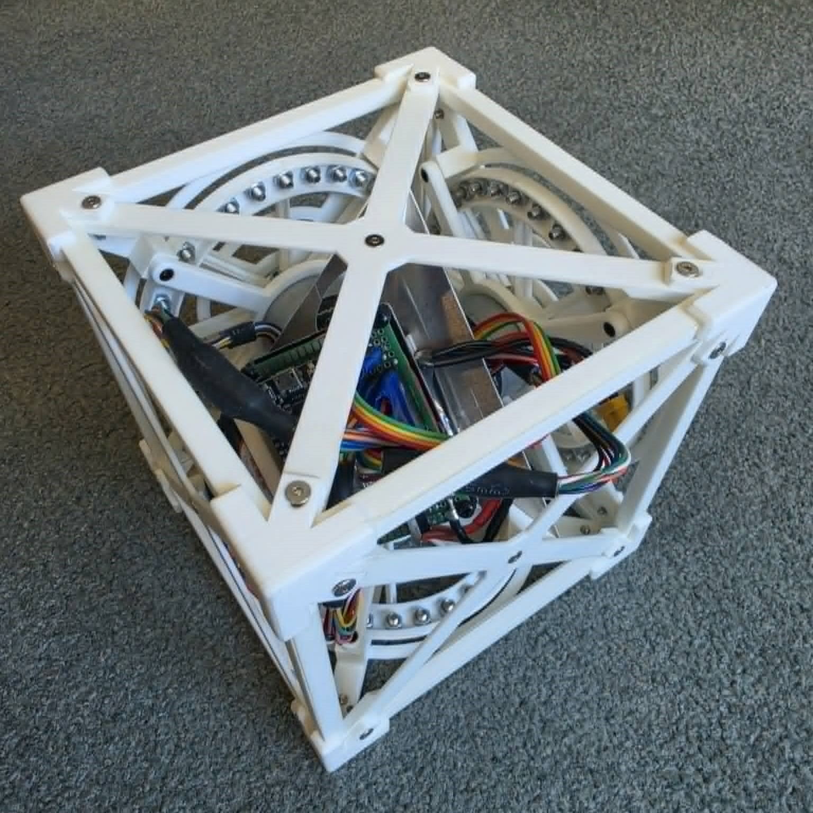
  </a>
  

    <h3 style="margin:0 0 8px 0;"><a href="https://yoursite.com/project-1" style="text-decoration:none; color:#1a1a1a;">Cubli (WIP)</a></h3>
    
Inspired by the project of the same name from ETH Zurich, I decided to build my own little controls sandbox. The goal is to get the cube to balance on a corner or an edge.

    

      #controls#dynamics#PID#SS#LQR#systemID
    

  

## 2025

  <h3 style="margin:0 0 8px 0;"><a href="https://yoursite.com/project-1" style="text-decoration:none; color:#1a1a1a;">Beyond EKF</a></h3>
  
An exploratory navigation project that employs filtering algorithms not classically taught in school but widely used in the world.

  

    #GPS#navigation#EKF#UKF#particle-filter#H-infinity
  

  <h3 style="margin:0 0 8px 0;"><a href="https://yoursite.com/project-1" style="text-decoration:none; color:#1a1a1a;">A Perceptive Markowitz Model</a></h3>
  
An exercise in optimization techniques: a simple portfolio composition optimizer.

  

    #finance#genetic-algorithms#markowitz-model
  

  <a href="https://yoursite.com/project-1" style="flex-shrink:0;">
    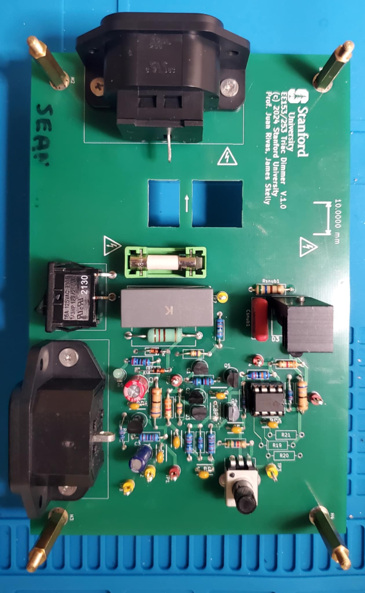
  </a>
  

    <h3 style="margin:0 0 8px 0;"><a href="https://yoursite.com/project-1" style="text-decoration:none; color:#1a1a1a;">Triac Light Dimmer</a></h3>
    
A showcasing of power electronic principles, all to dim a light.

    

      #power-electronics#rectifiers#converters#FETs
    

  

## 2024

  <a href="https://yoursite.com/project-1" style="flex-shrink:0;">
    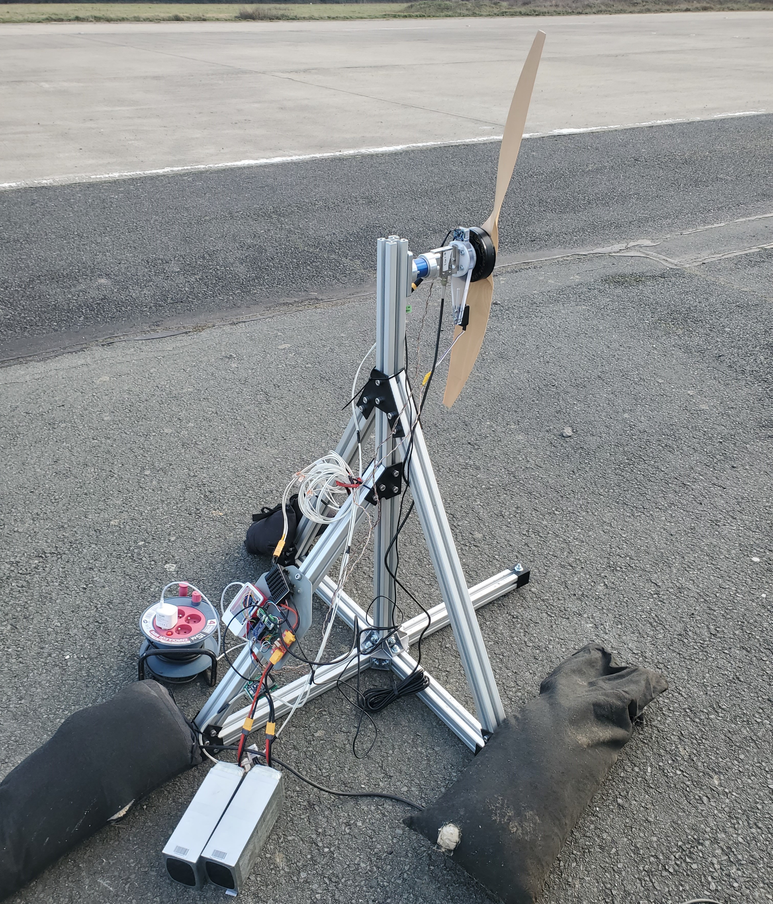
  </a>
  

    <h3 style="margin:0 0 8px 0;"><a href="https://yoursite.com/project-1" style="text-decoration:none; color:#1a1a1a;">Wendy II</a></h3>
    
Completely unrelated to Wendy I, this is a propulsion system test-bench that I designed for electric propellers.

    

      #dynamics#propulsion#instrumentation#embedded-systems#RPi5
    

  

  <a href="https://yoursite.com/project-1" style="flex-shrink:0;">
    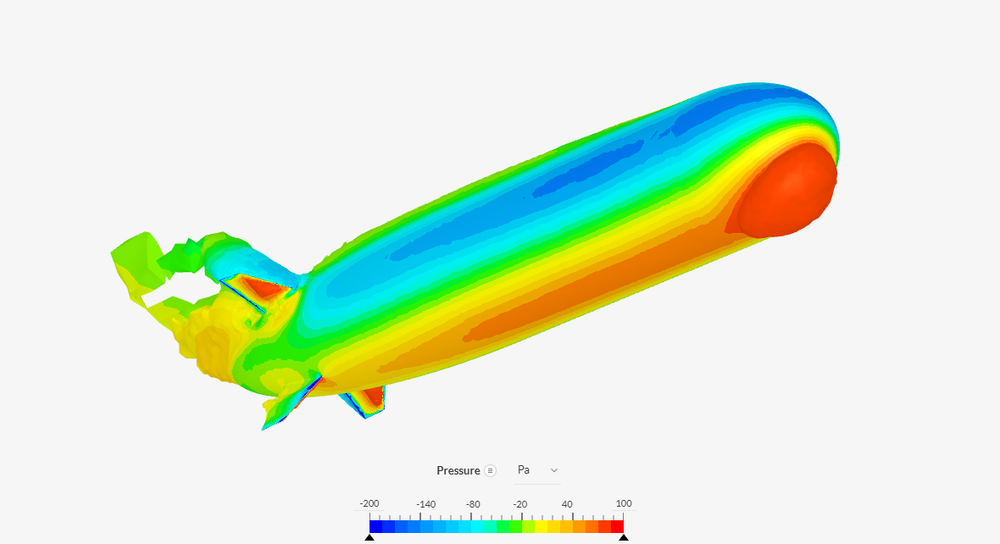
  </a>
  

    <h3 style="margin:0 0 8px 0;"><a href="https://yoursite.com/project-1" style="text-decoration:none; color:#1a1a1a;">Airship Aerodynamics</a></h3>
    
My first CFD project was to characterize the aerodynamic coefficients of an airship's envelope across varying attitudes.

    

      #CFD#simulation#aerodynamics
    

  

  
  

    <h3 style="margin:0 0 8px 0;"><a href="https://yoursite.com/project-1" style="text-decoration:none; color:#1a1a1a;">Wendy I</a></h3>
    
An NDA-friendly account of my internship work with MIT-spinout De-Ice.

    

      #inverters#thermal-management#instrumentation#heat-transfer
    

  

## 2023

  <a href="https://yoursite.com/project-1" style="flex-shrink:0;">
    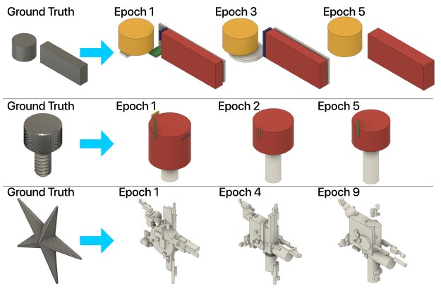
  </a>
  

    <h3 style="margin:0 0 8px 0;"><a href="https://yoursite.com/project-1" style="text-decoration:none; color:#1a1a1a;">Parametric Design Learning (PaDeSa)</a></h3>
    
A collaborative project riding the then-nascent AI train. If AI can generate images and videos, why can't it generate... 3D objects?

    

      #engineering-design#regression#GAN#classification#RL
    

  

  <a href="https://yoursite.com/project-1" style="flex-shrink:0;">
    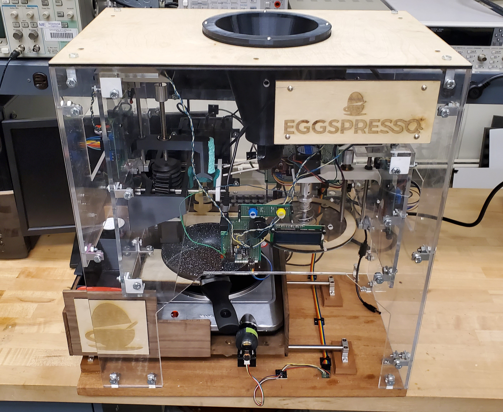
  </a>
  

    <h3 style="margin:0 0 8px 0;"><a href="https://yoursite.com/project-1" style="text-decoration:none; color:#1a1a1a;">Eggspresso</a></h3>
    
My mechanical engineering capstone project. An ambitious endeavor to have breakfast eggs be as easy as your Keurig coffee.

    

      #mechatronics#manufacturing#design#prototyping#power
    

  

  <a href="https://yoursite.com/project-1" style="flex-shrink:0;">
    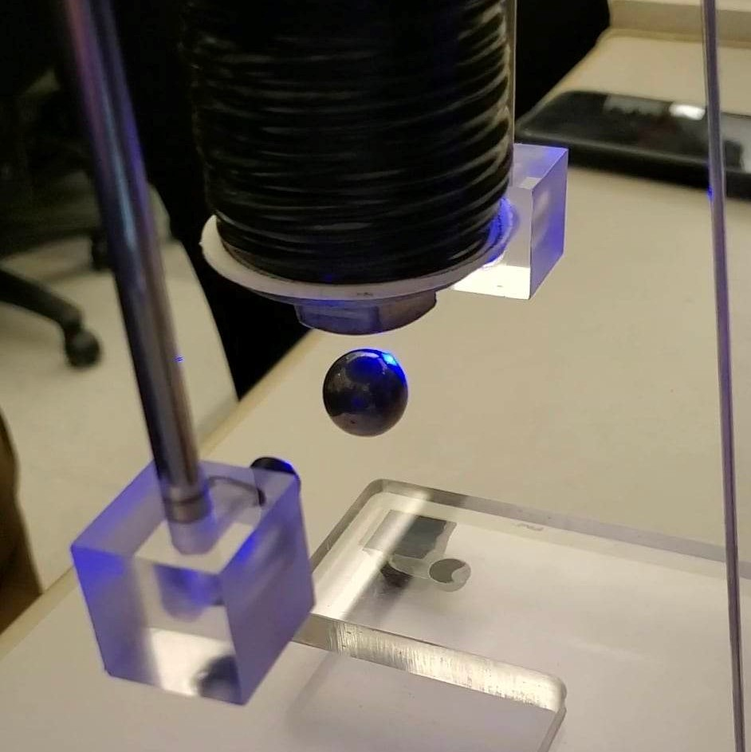
  </a>
  

    <h3 style="margin:0 0 8px 0;"><a href="https://yoursite.com/project-1" style="text-decoration:none; color:#1a1a1a;">Magnetic Levitation and Balanced Inverted Pendulum</a></h3>
    
We have graduated from Simulink models to real-world systems.

    

      #PID#SS-control#dynamics#modeling#robustness
    

  

## 2022

  <a href="https://yoursite.com/project-1" style="flex-shrink:0;">
    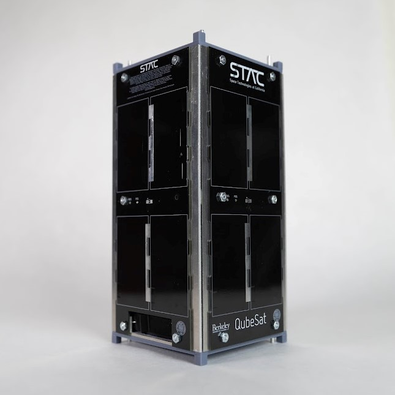
  </a>
  

    <h3 style="margin:0 0 8px 0;"><a href="https://yoursite.com/project-1" style="text-decoration:none; color:#1a1a1a;">Qubesat</a></h3>
    
The single project I dedicated the most of my time to at Berkeley. We tried to launch this shoe-sized satellite containing an experimental quantum gyroscope.

    

      #satellite#bus#structures#avionics#thermal#NASA#Astra
    

  

## 2021

  <a href="https://yoursite.com/project-1" style="flex-shrink:0;">
    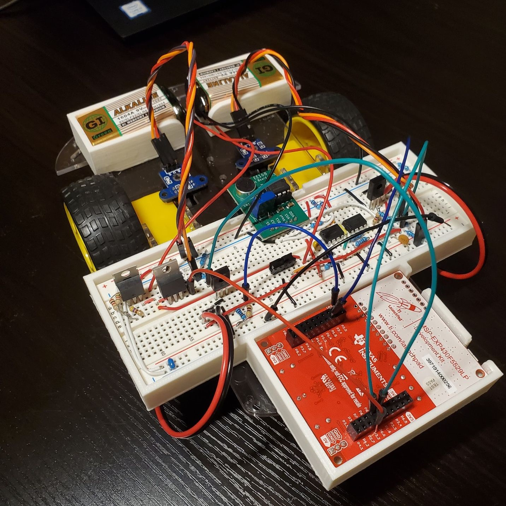
  </a>
  

    <h3 style="margin:0 0 8px 0;"><a href="https://yoursite.com/project-1" style="text-decoration:none; color:#1a1a1a;">Voice Controlled Car</a></h3>
    
We used the most rudimentary of ML methods to teach a car to recognize 4 voice commands.

    

      #circuits#PCA#SVD#controls
    

  

  <a href="https://yoursite.com/project-1" style="flex-shrink:0;">
    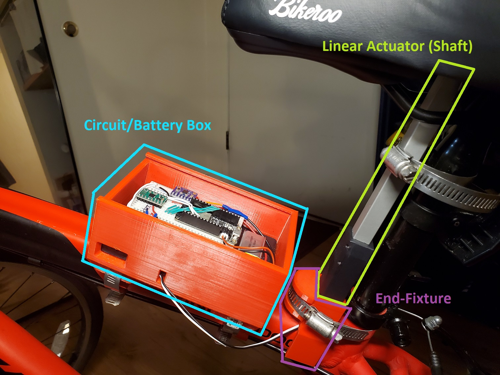
  </a>
  

    <h3 style="margin:0 0 8px 0;"><a href="https://yoursite.com/project-1" style="text-decoration:none; color:#1a1a1a;">Bike Thief Violator</a></h3>
    
My first true mechatronics project. I had this contraption rigged to my bike for all my Berkeley years.

    

      #mechatronics#ESP32#IMU#H-bridge
    

  

  <a href="https://yoursite.com/project-1" style="flex-shrink:0;">
    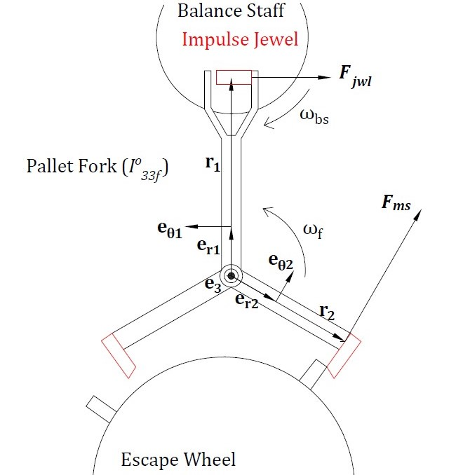
  </a>
  

    <h3 style="margin:0 0 8px 0;"><a href="https://yoursite.com/project-1" style="text-decoration:none; color:#1a1a1a;">Mechanical Watch Escapement</a></h3>
    
A study on the internal dynamics of a mechanical watch.

    

      #dynamics#pendulum#tensors
    

  

## < 2020

  <a href="https://yoursite.com/project-1" style="flex-shrink:0;">
    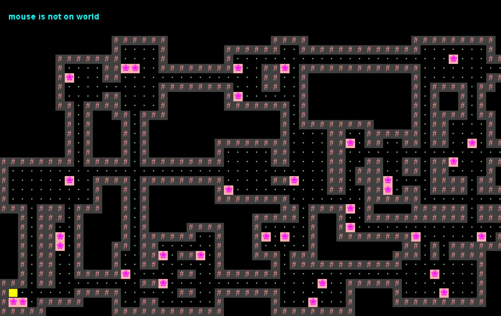
  </a>
  

    <h3 style="margin:0 0 8px 0;"><a href="https://yoursite.com/project-1" style="text-decoration:none; color:#1a1a1a;">Build Your Own World</a></h3>
    
A simple PvP game that served as an exercise in the usage of data structures.

    

      #game-design#data-structures#hashmaps#a-star
    

  

  <a href="/projects/scioly.md" style="flex-shrink:0;">
    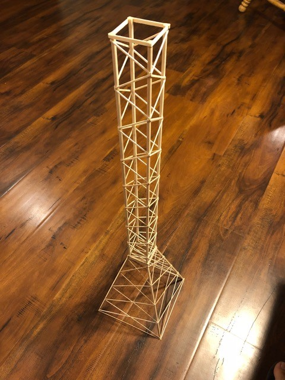
  </a>
  

    <h3 style="margin:0 0 8px 0;"><a href="/projects/scioly.md" style="text-decoration:none; color:#1a1a1a;">Science Olympiad Builds</a></h3>
    
I was an engineering specialist for my years as a competitor. Here is my high school highlight reel.

    

      #tower#boomilever#helicopter#mousetrap-vehicle#optics#wind-power#scioly
    

  

# Courses
## Stanford

### Summer 2026
- **EE364A**: Convex Optimization (S. Boyd)
- **16.S897**: Spacecraft ADCS (Z. Manchester)
### Spring 2026
- **AA212**: Advanced Linear Feedback Control (M. Schwager) [[cheatsheet]](./assets/pdfs/212_compiled_notes.pdf)
- **AA283**: Aircraft and Rocket Propulsion (T. Lee) [[cheatsheet]](./assets/pdfs/AA283_cheatsheet.pdf)
### Winter 2026
- **AA279A**: Space Mechanics (A. Ermakov) [[cheatsheet]](./assets/pdfs/279A_Final_Cheatsheet.pdf)
- **OCEANS 261H**: Marine Invertebrate Zoology (R. Elahi) [[field notebook]]()
### Fall 2025
- **AA210A**: Fundamentals of Compressible Flow (K. Hara) [[cheatsheet]](./assets/pdfs/210A%20Final%20Cheatsheet.pdf)
- **AA272**: Global Positioning Systems (G. Gao) [[project]](./assets/pdfs/Beyond%20EKF-%20AA272%20Final.pdf)
- **AA274**: Principals of Robot Autonomy (M. Schwager)
### Spring 2025
- **AA203**: Optimal Control (M. Pavone) [[cheatsheet]](./assets/pdfs/203_cheatsheet.pdf)
- **AA222**: Engineering Design Optimization (M. Kochenderfer) [[cheatsheet]](./assets/pdfs/222_cheatsheet.pdf) [[project]](./assets/pdfs/A_Perceptive_Markowitz_Model.pdf)
- **EE253**: Power Electronics (J. Rivas)
### Fall 2023
- **AA242**: Classical Dynamics (S. Close) [[cheatsheet]](./assets/pdfs/242_cheatsheet.pdf) [[report]](./assets/pdfs/Passive_Impulsive_Cube_Balancing.pdf)
- **AA228**: Decision Making Under Uncertainty (M. Kochenderfer) [[cheatsheet]](./assets/pdfs/228_cheatsheet.pdf) [[report]](./assets/pdfs/Parametric_Design_Learning.pdf)
- **CS229**: Machine Learning (A. Ng) [[cheatsheet]](./assets/pdfs/229_cheatsheet.pdf) [[project]](./assets/pdfs/PaDeSA.pdf)

## Berkeley

### Spring 2023
- **ME 102B**: Mechatronics Design (H. Kazerooni) [[course review]] [[final project]]
- **EE C128**: Feedback Control Systems (S. Soujoudi) [[cheatsheet]](./assets/pdfs/EEC128_final_cheatsheet.pdf) [[course review]]
- **ME 185**: Continuum Mechanics (D. Steigmann) [[cheatsheet]](./assets/pdfs/185-final-reference-sheet.pdf)
[[course review]]
- **UGBA 104**: Introduction to Business Analytics (L. Yang) [[cheatsheet]](./assets/pdfs/UGBA104-final-cheatsheet.pdf) [[course review]]
- **UGBA 105**: Leading People (E. Kass) [[course review]]
- **UGBA 198**: Marketing for Gen Z (B. Zhang) [[course review]]
### Fall 2022
- **EE 118**: Introduction to Optical Engineering (B. Kante) [[cheatsheet]](./assets/pdfs/EE118_cheatsheet.pdf)
- **ME 103**: Experimentation and Measurements (M. Gollner) [[final report]](./assets/pdfs/ME103_Custom_Lab.pdf) 
- **UGBA 101A**: Microeconomic Analysis (T. Fitch)
- **UGBA 135**: Personal Finance (T. Odean)
- **UGBA 196**: M.E.T. seminar (S. Chaudhuri)
### Spring 2022
- **EE 120**: Signals and Systems (B. Ayazifar) [[cheatsheet]](./assets/pdfs/EE120-cheatsheet.pdf) [[course review]]
- **ME 109**: Heat Transfer (C. Grigoropoulos) [[cheatsheet]](./assets/pdfs/ME109-cheatsheet.pdf) [[course review]]
- **ME C180**: Engineering Analysis using FEM (S. Govindjee) [[cheatsheet]](./assets/pdfs/MEC180-cheatsheet.pdf) [[course review]]
- **PHILO 170**: Descartes (T. Crockett)
- **UGBA 100**: Business Communication
- **UGBA 102B**: Managerial Accounting (J. Briginshaw)
### Fall 2021
- **ME 100**: Electronics for the Internet of Things (G. Anwar)
- **ME 106**: Fluid Mechanics (R. Alam)
- **ME 108**: Mechanical Behavior of Engineering Materials (G. O'Connell)
- **ME 132**: Dynamic Systems and Feedback
- **UGBA 106**: Marketing
### Spring 2021
- **EECS 16B**: Designing Information Devices and Systems II
- **ME 40**: Thermodynamics
- **ME 104**: Engineering Mechanics II
- **UGBA 101B**: Macroeconomic Analysis
- **UGBA 102A**: Financial Accounting
- **UGBA 107**: Business Ethics
### Fall 2020
- **CS 61B**: Data Structures (J. Hug)
- **CS 70**: Discrete Math (S. Rao)
- **ECON 1**: Introduction to Economics
- **ENGIN 27**: Introduction to Manufacturing and Tolerancing ()
- **ME C85**: Introduction to Solid Mechanics (G. Gu)
- **STAT 88**: Probability and Statistics in Data Science
### Spring 2020
- **EECS 16A**: Designing Information Devices and Systems I
- **ENGIN 25**: Visualization for Design
- **ENGIN 26**: Three-Dimensional Modeling for Design
- **MATH 54**: Linear Algebra and Differential Equations (N. Srivastava)
- **MUSIC R1B**: Wes Anderson Soundtracks
- **PHYSICS 7B**: Physics for Scientists and Engineers
### Fall 2019
- **CE 92**: Introduction to Civil and Environmental Engineering
- **DATA 8**: Foundations of Data Science (S. Sahai)
- **ENGIN 7**: Introduction to Computer Programming for Scientists and Engineers (R. Alam)
- **MATH 53**: Multivariable Calculus (K. Talaska) 
- **UGBA 10**: Principles of Business
- **UGBA 196**: M.E.T. seminar